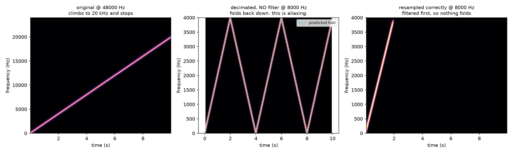
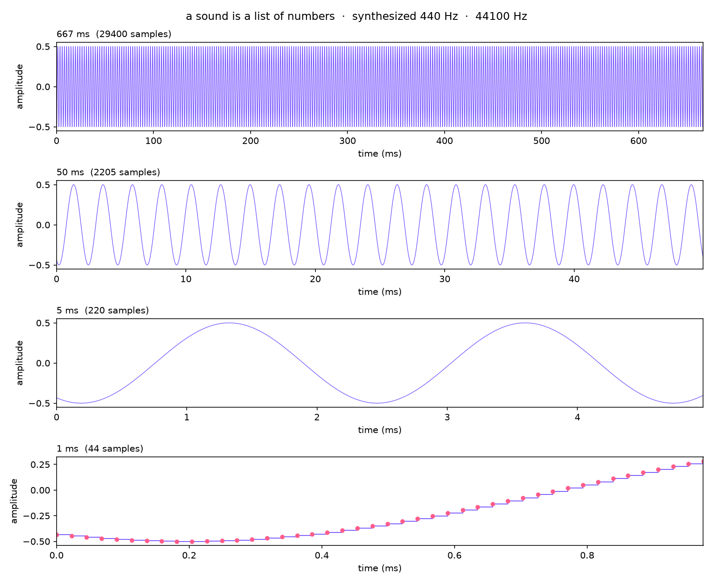

# Day 01: Air pressure becomes a number

## The ear does this

As we know, the eardrum is a transducer. Pressure variation in air becomes mechanical motion, the ossicles pass it to the cochlea, and hair cells convert it into neural firing. It is a continuous system from end to end. There is no sample rate anywhere in it.

## The machine does this

Measures the pressure a fixed number of times per second and stores each measurement as an integer.

- **Sample rate**: frequency. 44,100 times a second is standard.
- **Nyquist**: you can only represent frequencies below *half* the sample rate. Hearing tops out near 20 kHz, so you need 40 kHz minimum, plus headroom for the anti-alias filter. That is where 44.1 kHz comes from.
- **Bit depth**: how precisely each measurement is stored. 16 bits gives roughly 96 dB of dynamic range, and the leftover error is quantization noise.

## Where sound breaks

**Aliasing.** When it is sampled too slowly and frequencies above Nyquist do not vanish, they
*fold back* and reappear as lower frequencies, indistinguishable from real ones. It is not degradation you can clean up afterward. The information is gone and has been replaced with something false.

And the deeper point: **aliasing has no perceptual counterpart at all.** The cochlea cannot alias, because it never samples.

## Run it

```bash
source .venv/bin/activate
python labs/day-01-sampling/staircase.py          # optionally pass an audio file
python labs/day-01-sampling/aliasing.py
```

Then open `out/` and **listen in this order**:

1. `sweep_48k.wav` — climbs to 20 kHz and stops.
2. `sweep_resampled_8k.wav` — climbs, stops earlier at 4 kHz. Correct.
3. `sweep_aliased_8k.wav` — climbs, hits 4 kHz, and comes back **down**.

That descent is a frequency that was never played.

## Output



Left: the original, climbing to 20 kHz. Middle: decimated with no filter, folding off the 4 kHz ceiling and the 0 Hz floor twice, with the predicted fold overlaid as a dashed line and sitting exactly on the measurement. Right: resampled properly, so the sweep
simply stops at 4 kHz and nothing comes back.



Indicates the same waveform at four zoom levels. In the last panel the samples become visible as
dots, and the line connecting them is revealed as an assumption.

Also written: three `.wav` files. Those are intentionally gitignored (regenerable, and the blanket
audio rule is what keeps copyrighted source material out of a public repo by accident).

## A bug worth recording

The first version of this lab used `scipy.signal.resample_poly` for the "correct"
panel, and that panel folded almost as badly as the broken one. The default Kaiser
anti-alias filter gives roughly 40 dB of stopband attenuation, which is not close to
enough for a full-scale sweep: 40 dB down is still plainly visible on a spectrogram.
Switching to `soxr_vhq` (past 100 dB) fixed it.

Two lessons, and the second is the one that generalizes. First, "I applied the
anti-aliasing filter" is not a binary, it is a number, and the number matters. Second,
the bug was only visible because all three panels shared a fixed 80 dB display range.
On autoscaled axes it would have looked fine.

## Sources

- Julius O. Smith, *Mathematics of the DFT*, CCRMA Stanford —
  https://ccrma.stanford.edu/~jos/mdft/
- Meinard Müller, *Fundamentals of Music Processing*, Chapter 2 —
  https://www.audiolabs-erlangen.de/resources/MIR/FMP/C2/C2.html
- Shannon, "Communication in the Presence of Noise," Proc. IRE, 1949
- librosa `load` / `resample`; scipy `resample_poly`, `chirp`
