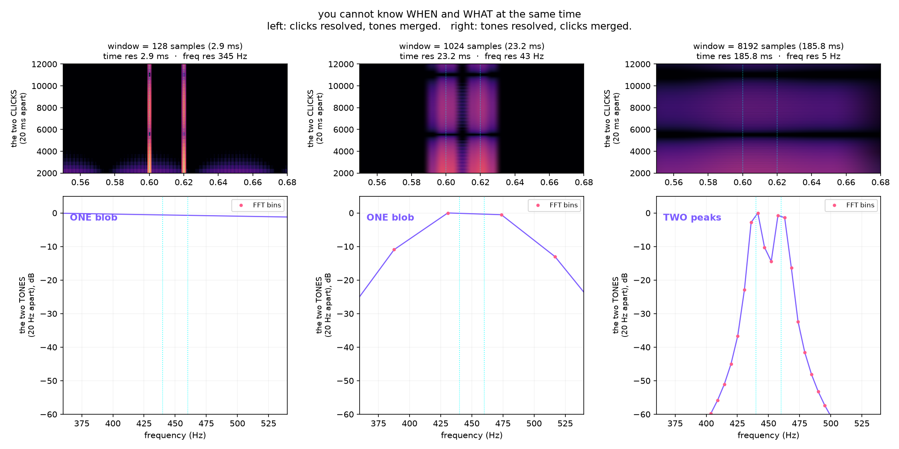
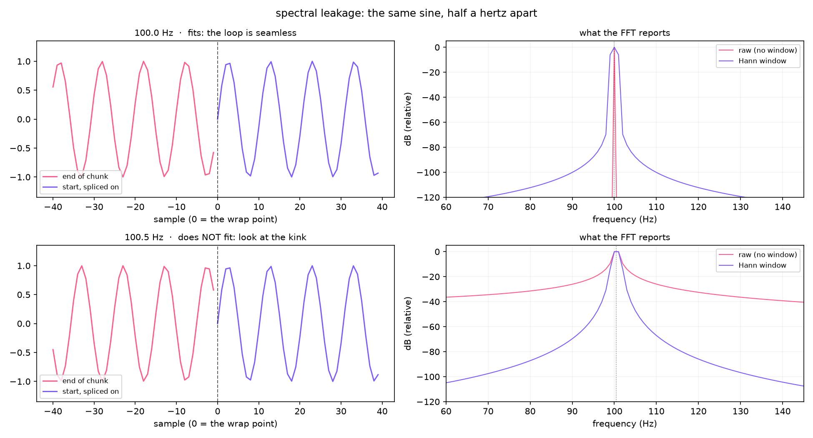

# Day 02: Frequency becomes pitch

## The ear does this

The basilar membrane is a mechanical frequency analyzer. It is stiff and narrow at one
end, floppy and wide at the other, so high frequencies peak near the base and low ones
near the apex. Position becomes frequency, and that map, **tonotopy**, is preserved all
the way up into auditory cortex. There is a physical place in your head for 440 Hz.

Crucially, the ear does this **continuously and all at once**. It is not chopping the
signal into chunks and analyzing each one.

## The machine does this

The **DFT**: correlate the signal against a sinusoid at every candidate frequency and
see which ones line up. If a frequency is present, the products reinforce and the sum is
large. If it isn't, they cancel. That's the whole idea, and `dft_by_hand.py` writes it
out in four lines and checks it against numpy.

The **FFT** is not a different transform. It is the same answer computed by noticing that
the naive version recalculates the same products over and over. Here it came out 400x
faster on 1024 samples, with a max difference of 1.4e-10, which is float rounding.

To find out *when* a frequency was present you chop the signal into short chunks and
transform each one. That's the **STFT**, and it is where the trouble starts.

## Where it breaks

### 1. You cannot know when and what at the same time

- **Short windows**: precise about *when*, vague about *what*.
- **Long windows**: precise about *what*, vague about *when*.

`uncertainty.py` builds a signal that makes this inescapable. It has two tones 20 Hz
apart (separating them needs a window **longer** than 50 ms) and two clicks 20 ms apart
(separating those needs a window **shorter** than 20 ms). Those requirements contradict
each other.



Left column resolves the clicks and merges the tones. Right column resolves the tones and
merges the clicks. No column does both, and no window length exists that would.

| window | time res | freq res | product |
|--------|----------|----------|---------|
| 128 | 2.9 ms | 345 Hz | 1000 |
| 1024 | 23.2 ms | 43 Hz | 1000 |
| 8192 | 185.8 ms | 5 Hz | 1000 |

The product never changes, and it's worth being honest about why: it *cannot*. Time
resolution is `n/fs` and frequency resolution is `fs/n`, so the product is 1 second-hertz
for any `n`. That is algebra, not a measurement.

Which is exactly what makes it a wall rather than an engineering problem. You never gain
resolution by choosing a better window. You only choose which axis to spend a fixed
budget on.

**And this is where the ear wins.** The cochlea does not use one window length. It is
effectively a bank of filters that are broad at high frequencies and narrow at low ones,
so it gets good time resolution where transients live and good frequency resolution where
pitch lives. The STFT picks one window for the whole signal. That is the day 4 problem.

### 2. Spectral leakage

The DFT assumes your chunk repeats forever. If the waveform doesn't end where it started,
the assumed loop has a discontinuity, and a discontinuity is broadband, so the transform
reports energy at frequencies that are not in the signal.



Two sines, half a hertz apart. 100.0 Hz fits a whole number of cycles into the chunk, so
even the raw transform is clean. 100.5 Hz does not fit, and raw it smears energy across
the entire spectrum at only **-32 dB** down. A Hann window pushes that to **-86 dB**.

Real music never "happens to fit." This is the normal case, not an edge case.

## Run it

```bash
source .venv/bin/activate
python labs/day-02-fft/dft_by_hand.py
python labs/day-02-fft/windows.py
python labs/day-02-fft/uncertainty.py
```

## Bugs worth recording

**Both figures were wrong the first time, in the same way: I plotted something adjacent
to the point instead of the point.**

The tone panels started out as spectrograms. But two tones 20 Hz apart beat against each
other at 20 Hz, and the beating dominated the image, so all three panels looked like
vertical stripes and none of them answered "one peak or two." A single spectrum slice
answers it in one glance.

The leakage panel started out plotting the first 80 samples and the last 80 samples on
shared axes, which just looks like two out-of-phase sines whether or not there's a
discontinuity. What matters is the *join*, so splicing the tail directly onto the head and
marking the seam is the plot that actually shows it.

Carried over from day 1: every spectrogram here uses a fixed dB range instead of
autoscaling. Autoscaling is what hid day 1's filter bug.

## Sources

- Meinard Müller, *Fundamentals of Music Processing*, Ch. 2 —
  https://www.audiolabs-erlangen.de/resources/MIR/FMP/C2/C2.html
- 3Blue1Brown, "But what is the Fourier Transform? A visual introduction"
- Julius O. Smith, *Spectral Audio Signal Processing*, CCRMA —
  https://ccrma.stanford.edu/~jos/sasp/
- Harris, "On the Use of Windows for Harmonic Analysis with the Discrete Fourier
  Transform," Proc. IEEE, 1978 (the window comparison paper everyone still cites)
- Cooley and Tukey, "An Algorithm for the Machine Calculation of Complex Fourier
  Series," Math. Comp., 1965

## A third bug worth recording (added while making the video assets)

The animated version labels each frame "2 NOTES ✓" or "1 BLOB ✗". I first computed
that label from the textbook rule, *resolved if frequency resolution is finer than the
tone spacing*, and the label disagreed with the picture on screen.

Two separate things were wrong.

1. That rule is the **rectangular-window** criterion. A Hann window's main lobe is
   several times wider, so in practice these two tones need roughly 3 bins of separation,
   not 1. The rule said "resolved" while the plot still showed one plateau.
2. Switching to *count the peaks in the curve* was worse in a more interesting way. At
   n = 2048 it happily found two peaks, sitting at **431 and 474 Hz**, nowhere near the
   real 440 and 460. With a window shorter than the 50 ms beat period you get lobes from
   the amplitude modulation of the two tones against each other, not from resolving
   anything.

The verdict now requires two peaks **and** requires them to land within 8 Hz of the
actual tones, which is the claim being made. `resolves_notes` and `resolves_clicks` in
`uncertainty.py` are shared by every figure here, so the still, the video still, and the
animation cannot drift apart.

Measured transition: these tones resolve somewhere between a 93 ms and a 139 ms window.
The textbook rule predicted 50 ms.
