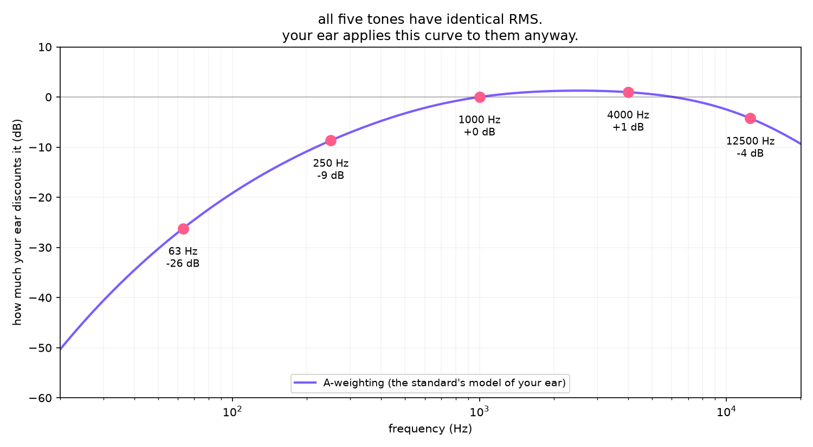

# Day 03: Amplitude becomes loudness

## The ear does this

Your ear is not a microphone with a number on it. Sensitivity depends on frequency,
peaking somewhere around 3 to 4 kHz (roughly where a baby's cry and the consonants of
speech live) and falling off hard at the bottom and top. It also depends on level: the
curve changes shape as things get louder, which is why a mix that sounded balanced quiet
sounds bass-heavy loud.

Fletcher and Munson mapped this in 1933 by asking people which tones sounded equally loud.
The modern version is ISO 226. Both are, fundamentally, **surveys**. There is no formula
for loudness derivable from physics, because loudness is not a property of the air. It is
a property of a listener.

## The machine does this

Puts a number on it and hopes.

- **peak dBFS** — the largest single sample. What clipping cares about.
- **RMS dBFS** — average energy. What physics cares about.
- **A-weighting** (IEC 61672) — RMS after discounting frequencies your ear is bad at. A
  closed-form curve approximating the inverse of the 40-phon contour. Exactly 0 dB at
  1 kHz by definition, which is a good thing to assert against.
- **LUFS** (ITU-R BS.1770) — what every streaming platform normalises to, so it is the
  meter that actually decides how loud your song comes out on Spotify.

## Where it breaks

### Five tones, identical measurements, obviously different loudness

`equal_loudness.py` makes five tones at 63, 250, 1000, 4000 and 12500 Hz with **exactly
the same RMS**. Play `out/all_five_tones.wav`. The 63 Hz one is nearly inaudible; the
4 kHz one is piercing.



| freq | peak dBFS | RMS dBFS | A-weighted | LUFS |
|------|-----------|----------|------------|------|
| 63 Hz | -17.0 | -20.1 | -46.3 | -23.4 |
| 250 Hz | -17.0 | -20.1 | -28.7 | -20.9 |
| 1000 Hz | -17.0 | -20.1 | -20.1 | -20.1 |
| 4000 Hz | -17.0 | -20.1 | -19.1 | -16.8 |
| 12500 Hz | -17.0 | -20.1 | -24.3 | -16.7 |

| meter | spread across the five | verdict |
|-------|----------------------|---------|
| peak | 0.0 dB | identical |
| RMS | 0.0 dB | identical |
| A-weighted | 27.2 dB | wildly different |
| LUFS | 6.7 dB | wildly different |

Peak and RMS can't even rank them. Every tone ties exactly. That isn't rounding, it's
those meters saying frequency is none of their business.

### The awkward one: the industry standard is wrong here

At 12500 Hz, A-weighting says **-24.3 dB** (discount it, your ear is losing sensitivity)
and LUFS says **-16.7** (one of the loudest tones in the set). They disagree by **7.6 dB**
about the same file, and LUFS is the one that contradicts perception.

That gap is real and it is a limitation of the standard, not of this code. The
K-weighting inside BS.1770 has a high shelf that keeps boosting above 2 kHz, modelling
head diffraction for broadband programme material. It was never designed to judge a lone
12.5 kHz sine, and on one it is simply wrong.

Worth sitting with, because this is the meter every streaming service uses on every song.

### The deeper problem

Days 1 and 2 broke because the machine works in discrete chunks. Day 3 breaks for a
different reason, and a worse one: **there is no correct answer to compute.** Loudness
isn't in the signal. Every meter above is a compressed opinion about human beings, derived
from surveys, and A-weighting and LUFS disagree because they are opinions from different
decades built for different purposes.

None of these meters is broken. They are just not answering the question you asked, which
was about a person.

## Run it

```bash
source .venv/bin/activate
python labs/day-03-loudness/equal_loudness.py
cd labs/day-03-loudness && python meters.py
```

Then play `out/all_five_tones.wav`. Five tones, one identical RMS, 0.4 s apart.

## Sources

- Fletcher and Munson, "Loudness, its definition, measurement and calculation," JASA, 1933
- ISO 226:2003, equal-loudness-level contours (the standard itself is paywalled; the
  curves are widely reproduced)
- IEC 61672-1, A-weighting (the closed form implemented in `equal_loudness.py`)
- ITU-R BS.1770-4, loudness and true-peak measurement — free from the ITU
- `pyloudnorm` (Steinmetz and Reiss), a reference BS.1770 implementation —
  https://github.com/csteinmetz1/pyloudnorm
