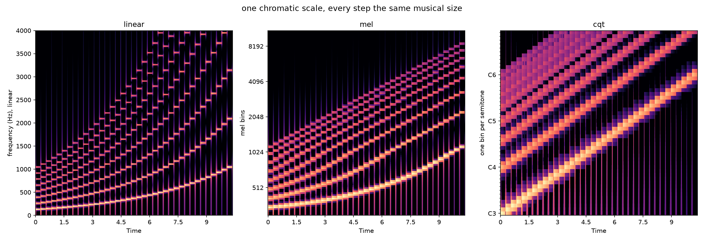
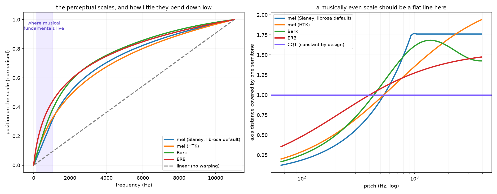

# Day 04: The perceptual frequency axis

## The ear does this

Pitch perception is roughly logarithmic. An octave is a *doubling* of frequency, and
it feels like the same size step whether you play it low or high. 100 to 200 Hz and
2000 to 4000 Hz are both one octave, even though one spans 100 Hz and the other 2000.

Underneath that, the cochlea groups nearby frequencies into **critical bands**, which
get wider as you go up. Bark (Zwicker, 1961) and ERB (Glasberg and Moore, 1990) are
two measurements of that widening.

## The machine does this

Warps the frequency axis to try to match. Three attempts:

- **mel** (Stevens, Volkmann and Newman, 1937) — built by asking people to adjust a
  tone until it sounded "half as high." It became the backbone of *speech* recognition.
- **Bark** (Zwicker, 1961) — critical bands.
- **CQT** (Brown, 1991) — not a perceptual scale at all, just log-spaced bins, one per
  semitone by construction.

## Where it breaks

### The measurement

Synthesize a chromatic scale, C3 to C6, 37 semitones, every step the same *musical*
size. Then ask: does one semitone cover the same distance up the axis everywhere?



| representation | semitone step, C3 → C6 |
|---|---|
| linear STFT (no warping) | **7.55x** |
| mel, Slaney (librosa's default) | **7.23x** |
| mel, HTK | **3.66x** |
| CQT | **1.00x** |

### 1. Over the musical register, the default mel is 96% as uneven as doing nothing

The CQT is 1.00x by construction: one semitone, one bin, top to bottom. Linear grows
7.55x. And librosa's default mel comes in at 7.23x, which is a rounding error away from
applying no perceptual scale at all.

### 2. "Mel spectrogram" does not name one thing

This is the day's real finding, and I only got to it because the two halves of my own
lab disagreed with each other.

There are **two mel formulas in common use**:

- **HTK**: `2595 · log10(1 + f/700)`. Logarithmic everywhere.
- **Slaney**: **linear below 1000 Hz**, logarithmic above. Not an approximation, that
  is the definition.

librosa defaults to Slaney. **39 of its 128 default bins sit inside the linear region**,
spaced a constant 26.2 Hz apart. And C3 to C6 lives almost entirely inside that region,
so across the range where nearly every melody on earth sits, the "perceptual" axis is
not being perceptual.

The two formulas disagree by **2x** on the same signal, and papers and repos routinely
say "mel spectrogram" without specifying which. If you compare a result against a
published number and it is off by about a factor of two on anything pitch-related, this
is a candidate explanation.



The right panel is the summary: a musically even axis would be a flat line, and only
the CQT is one.

### So why does anyone use mel?

Because it was never for this. Mel was fit to speech, where the fundamental matters far
less than the formant structure sitting well above 1 kHz, exactly where Slaney mel
*does* compress. MFCCs (day 5) then throw pitch away on purpose. Mel is a good tool
doing the job it was built for, borrowed by a field with a different job.

## Run it

```bash
source .venv/bin/activate
python labs/day-04-scales/chromatic.py
python labs/day-04-scales/scales.py
```

Then play `out/chromatic_scale.wav`. Every step is the same musical size, and your ear
hears it as even. Only one of the three pictures agrees with you.

## Bug worth recording

The two scripts in this lab initially reported **7.23x** and **3.72x** for the same
quantity. I had written `hz_to_mel` by hand using the HTK formula in one file while the
other interpolated onto librosa's actual bin centres, which are Slaney. Neither was
wrong. They were measuring two different scales that share a name.

I would have shipped whichever number I happened to look at first if I had not
cross-checked them. Third day running that the bug was found by two things disagreeing
rather than by anything looking broken.

## Sources

- Stevens, Volkmann and Newman, "A Scale for the Measurement of the Psychological
  Magnitude Pitch," JASA, 1937
- Zwicker, "Subdivision of the Audible Frequency Range into Critical Bands," JASA, 1961
- Glasberg and Moore, "Derivation of auditory filter shapes from notched-noise data,"
  Hearing Research, 1990
- Judith C. Brown, "Calculation of a constant Q spectral transform," JASA, 1991
- Slaney, *Auditory Toolbox*, Interval Research, 1998 (the linear-below-1kHz formula)
- librosa `mel_frequencies`, `cqt`, `melspectrogram` (note the `htk=` flag)
