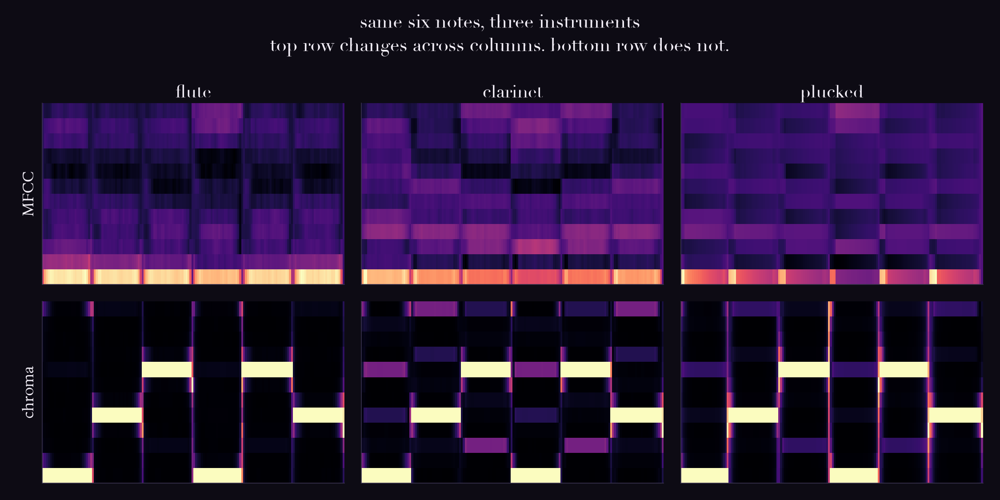
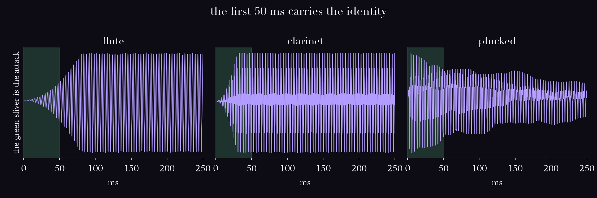

# Day 05: Timbre, or why a violin is not a flute

## The ear does this

Identifies an instrument in well under a second, often from the attack alone,
before a single full pitch period has elapsed.

Timbre is the one perceptual attribute defined **negatively**. ANSI's definition is
essentially "the attribute by which a listener judges two sounds with the same
loudness, pitch and duration to be dissimilar." aka a process of elimination.

## The machine does this

- **Spectral shape scalars**: centroid (brightness), rolloff, flatness, zero-crossing rate.
- **MFCCs** (Davis and Mermelstein, 1980): mel spectrum → log → DCT, keep the low
  coefficients. Built for speech recognition, where the talker's pitch is a nuisance
  variable to be removed.

## The measurement

Three synthetic instruments crossed with two melodies. Then two questions of each
feature: how far apart are two clips that share a melody but differ in instrument, and
how far apart are two that share an instrument but differ in melody?

| feature | instrument differs | melody differs | ratio | reads as |
|---|---|---|---|---|
| MFCC | 0.144 | 0.004 | **36.7x** | timbre only |
| chroma | 0.016 | 0.592 | **0.03x** | pitch only |
| centroid | 0.165 | 0.003 | 52.5x | timbre only |
| rolloff | 0.268 | 0.006 | 45.5x | timbre only |
| zero-crossing rate | 0.234 | 0.014 | 17.3x | timbre only |



MFCCs move 36.7x more when the instrument changes than when the melody does. Chroma is
the mirror image. Neither is broken; they are answers to two different questions.

Worth noticing: **spectral centroid, one number, separates these instruments better than
13 MFCCs do.** MFCCs are not magic. On this stimulus a scalar for "brightness" does the
same job.

## Where it breaks

### 1. Mean-pooled MFCCs are blind to time reversal, by construction

Reverse a note and its mean-pooled MFCCs move by **0.000004**, against a distance of
**0.324** between two different instruments. That is **0.001%** of an instrument change.

It is not a coincidence, it is guaranteed. For a real signal `|DFT|` is exactly invariant
under time reversal (measured difference: 1.4e-14). So every analysis frame keeps its
magnitude spectrum, only the frame ORDER flips, and mean-pooling discards order.

Play `out/plucked_A4_reversed.wav`. It is not a pluck any more, it is an organ swell.
Your ear reclassifies it instantly. The feature cannot see it at all.

Every "average the MFCCs over the clip" pipeline in music tagging inherits this.

### 2. MFCCs discard pitch on purpose, and music inherited the tool anyway

The mel filterbank is coarse and the DCT keeps only the low coefficients, which smooths
away harmonic fine structure. For speech that is correct: you want the word, not the
talker. For music it deletes half the content, and the field adopted them regardless.
Day 4's mel scale is the same story one layer down.

## The negative result



Saldanha and Corso (1964) cut the attack off recorded notes and identification collapsed.
Grey (1977) found attack time to be a principal perceptual axis of timbre. I tried to
reproduce that and got the opposite, three times:

| segment | instrument separation |
|---|---|
| whole note | 0.324 |
| attack only (50 ms) | 0.177 |
| sustain only | 0.317 |

The literature is not wrong. **My stimulus is.**

A real flute, clarinet and guitar holding the same note produce fairly *similar* steady
spectra: all harmonic, comparable rolloff. That similarity is exactly why removing the
attack wrecks human identification. Mine are not similar at all. One is nearly a sine
wave, one suppresses every even harmonic, one has nine strong partials. The sustains are
cartoonishly distinct, so of course the sustain separates them.

I built a dataset in which the effect I was looking for **could not appear**, and only
caught it because the number came out backwards.

Two earlier attempts, both worth recording:

1. First run used librosa's default `n_fft=2048`, which is **93 ms** at this sample rate,
   longer than the 50 ms attack being analysed. The "attack" MFCCs were mostly describing
   zero-padding. Fixed by scaling `n_fft` (and `n_mels`) to the segment.
2. Second attempt added onset transients with distinct spectral colour (breath, chiff,
   click) on the theory that the first version varied only envelope. It helped, and did
   not overturn the result, because the sustains were still too distinct.

The easy move was to keep tuning the synthesis until it agreed with the textbook. That
would have proved nothing.

## Run it

```bash
source .venv/bin/activate
python labs/day-05-timbre/instruments.py
cd labs/day-05-timbre
python mfcc_vs_chroma.py
python attack.py
```

Listen in this order:

1. `flute_A4.wav`, `clarinet_A4.wav`, `plucked_A4.wav` — all exactly 440 Hz, instantly
   distinguishable. That difference is timbre.
2. `plucked_A4.wav` then `plucked_A4_reversed.wav` — same spectrum, same MFCCs, and your
   ear says they are different instruments.

## Sources

- Davis and Mermelstein, "Comparison of Parametric Representations for Monosyllabic Word
  Recognition in Continuously Spoken Sentences," IEEE TASSP, 1980
- Saldanha and Corso, "Timbre Cues and the Identification of Musical Instruments," JASA, 1964
- Grey, "Multidimensional perceptual scaling of musical timbres," JASA, 1977
- Sethares, *Tuning, Timbre, Spectrum, Scale*, Springer, 2005
- Müller, *Fundamentals of Music Processing*, Ch. 1
- librosa `mfcc`, `chroma_cqt`, `spectral_centroid`, `spectral_rolloff`
