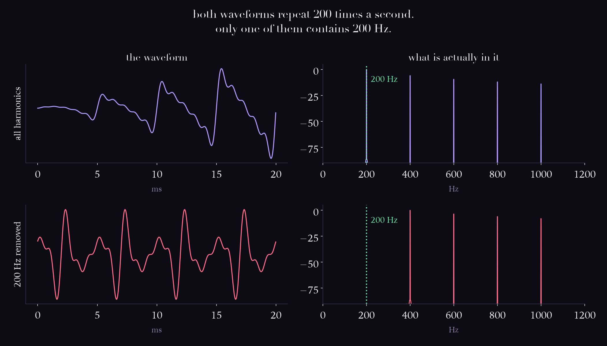
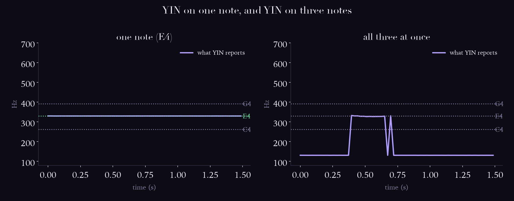

# Day 06: Pitch that isn't there

## The ear does this

Hears a pitch that is not present in the signal.

Play harmonics at 400, 600, 800 and 1000 Hz with **nothing at 200 Hz** and you hear a
200 Hz tone. The partials are all multiples of 200, so the waveform still completes a
cycle 200 times a second, and your auditory system reports the **repetition rate** rather
than the lowest frequency present.

This is why a phone speaker that cannot physically move enough air to produce 60 Hz still
lets you hear a bass line. It reproduces the harmonics and your brain supplies the root.

## The machine does this

Estimates f0. Autocorrelation, YIN (de Cheveigné and Kawahara, 2002), pYIN (Mauch and
Dixon, 2014), CREPE (Kim, Salamon, Li and Bello, 2018 — out of NYU MARL).

## The measurement



| signal | energy at 200 Hz |
|---|---|
| all harmonics | 1.000000 |
| fundamental removed | **0.000000** |

Zero. Not small, zero. And both waveforms still repeat 200 times a second.

| method | full | f0 removed |
|---|---|---|
| naive autocorrelation peak | 200.5 Hz | **100.0 Hz** |
| YIN | 200.2 Hz | **200.0 Hz** |

**YIN agrees with your ear.** The naive method drops an octave.

## Where it breaks

### 1. The octave error is structural, not unlucky

Here is how close that call was on the missing-fundamental signal:

| lag | autocorrelation |
|---|---|
| 400 Hz | 0.3481 |
| **200 Hz** | **0.9989** |
| **100 Hz** | **0.9990** |
| 66.7 Hz | 0.9970 |

200 and 100 are tied to three decimal places and **the wrong one wins by 0.0001.**

That is not bad luck. If a signal repeats every T seconds it also repeats every 2T, so
every true autocorrelation peak has an equally tall impostor an octave below it, and
another below that. YIN's cumulative mean normalised difference function exists
specifically to break that tie by penalising longer lags.

### 2. Polyphony is not "harder", it is outside the model



One note at a time, both methods are superb:

| note | true | YIN | error |
|---|---|---|---|
| C4 | 261.6 Hz | 261.7 Hz | +0.5 cents |
| E4 | 329.6 Hz | 329.7 Hz | +0.5 cents |
| G4 | 392.0 Hz | 392.1 Hz | +0.6 cents |

Half a cent. Then play all three together:

| method | answer |
|---|---|
| YIN on the chord | **130.8 Hz** |
| pYIN on the chord | 130.7 Hz |
| notes actually present | 262, 330, 392 Hz |

130.8 Hz is exactly **C3, an octave below the lowest note in the chord.**

And it is not a random failure. A major triad is close to a 4:5:6 ratio, so the three
waveforms only realign after a long common period. YIN found the period of the *mixture*,
correctly. The period of a mixture is not a note anybody played.

Your ear does something adjacent, since you do hear a C major chord as rooted on C. The
difference is that you also hear three separate notes. **YIN returns one number because
one number is all its model has room for.**

This is why day 9 has to separate sources before anything can ask them what note they are.

## Run it

```bash
source .venv/bin/activate
python labs/day-06-pitch/missing_fundamental.py
python labs/day-06-pitch/polyphony.py
```

**Listen with headphones or a real speaker**, in this order:

1. `reference_200hz.wav` — a plain 200 Hz tone.
2. `missing_fundamental.wav` — same pitch. Contains no 200 Hz whatsoever.

Phone speakers actually make this *more* convincing, since they cannot reproduce low
frequencies well anyway.

## Sources

- de Cheveigné and Kawahara, "YIN, a fundamental frequency estimator for speech and
  music," JASA, 2002
- Mauch and Dixon, "pYIN: a fundamental frequency estimator using probabilistic threshold
  distributions," ICASSP, 2014
- Kim, Salamon, Li and Bello, "CREPE: A Convolutional Representation for Pitch
  Estimation," ICASSP 2018 (arXiv:1802.06182)
- Schouten, "The perception of subjective tones," 1938 (the residue pitch work)
- Terhardt, "Pitch, consonance, and harmony," JASA, 1974 (virtual pitch)
- Müller, *Fundamentals of Music Processing*, Ch. 8
