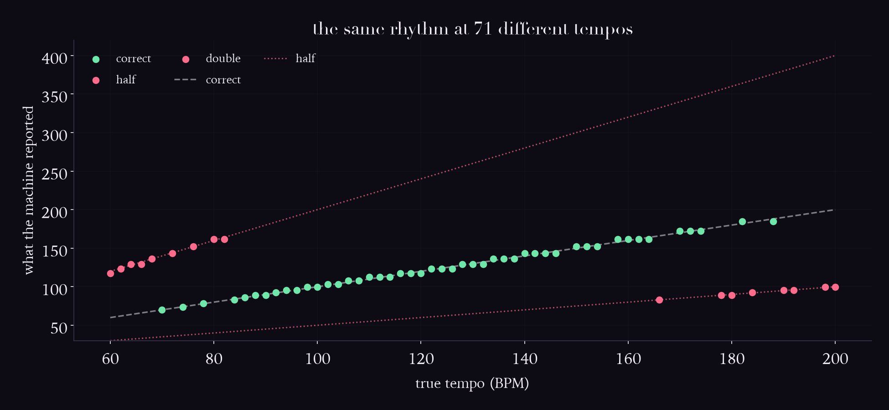
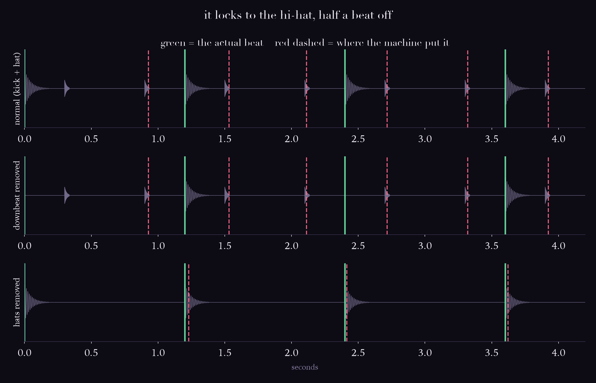

# Day 07: The beat is not in the signal

## The ear does this

Infers a pulse and then keeps it. You entrain to a beat, tap it, come in on it after a
rest, and feel a downbeat that nothing marks. The beat is a *construction*, not an event,
and it survives the absence of evidence.

You also know instantly which layer is the beat. Given a kick on 1 and 3 with a hi-hat on
every "and", nobody has to be told which one to tap.

## The machine does this

Onset detection (spectral flux), a tempogram, then dynamic-programming beat tracking
(Ellis, 2007). Find the events, then fit a periodic grid to them.

## Where it breaks

### 1. A third of tempo estimates are an octave off — and every miss is metrical

Sweep a plain four-on-the-floor pattern from 60 to 200 BPM and ask for the tempo:



| verdict | count | share |
|---|---|---|
| correct | 47 | 66% |
| double | 9 | 13% |
| half | 8 | 11% |
| 2/3 (the dotted level) | 7 | 10% |
| **not a metrical level** | **0** | **0%** |

**34% wrong, and zero of them are noise.** Every single miss is the same rhythm counted
at a different rate. The machine never failed to find a periodicity. It found a real one
and chose a level a human would not tap.

### 2. "The tempo" depends on a parameter, not just the audio

librosa's tempo estimator multiplies the tempogram by a log-normal prior centred on
`start_bpm`, which defaults to 120. Same audio, three settings:

| true | start=60 | start=120 | start=180 |
|---|---|---|---|
| 60 | **60.1** | 117.5 | 117.5 |
| 90 | 89.1 | 89.1 | 184.6 |
| 120 | 60.1 | 117.5 | 234.9 |
| 180 | 60.1 | 89.1 | **184.6** |

60 BPM reads as 60 with one setting and 117 with another. The audio did not change.
**"The tempo" is not a property of the recording, it is a property of the recording plus
an assumption about what tempo music usually is.**

### 3. It tracks the most regular thing, which is not the beat



Kick on beats 1 and 3, hi-hat on every off-beat:

| condition | tempo | distance to the KICK | distance to the HAT | locked to |
|---|---|---|---|---|
| normal | 99.4 | **319.7 ms** | **23.2 ms** | the hat (off-beat) |
| downbeat removed | 99.4 | 319.7 ms | 23.2 ms | the hat (off-beat) |
| hats removed | 49.7 | 23.9 ms | 276.1 ms | the kick |

It sits **23 ms from the off-beat and 320 ms from the beat.** Not confused, confidently
wrong: the hats are a perfectly even pulse and the kicks are not, so the hats win. The
tempo is right and the phase is half a beat out, which is the worst possible failure mode
because nothing in the output flags it.

A human hears kick-and-hat and knows which is the beat. Nothing in the audio says so. You
know because a kick on 1 and 3 is what a beat *sounds like*, and that is learned, not
measured.

## The experiment that couldn't work

I built lab 2 to test something else: remove the downbeat, and watch the tracker lose a
bar line a human still feels.

It changed nothing. Byte-identical output, 23.2 ms and 319.7 ms in both conditions.

At first that looked like a bug in my code, so I checked the signals actually differed
(they do — total energy 1272 vs 672). They differ and the tracker does not care, because
**it was never using the downbeat.** It had locked to the hats from the start.

So the planned experiment could not have produced a result, and finding out why is what
produced the real one. Second time in three days that a null result was more informative
than the thing I set out to measure.

## Run it

```bash
source .venv/bin/activate
cd labs/day-07-rhythm
python tempo_sweep.py
python silent_beat.py
```

Then play `normal.wav` and tap along. You will tap the kick. The machine taps the hat.

## Sources

- Bello, Daudet, Abdallah, Duxbury, Davies and Sandler, "A Tutorial on Onset Detection in
  Music Signals," IEEE TSAP, 2005 (Bello is NYU MARL)
- Ellis, "Beat Tracking by Dynamic Programming," Journal of New Music Research, 2007
- Grosche, Müller and Kurth, "Cyclic tempogram," ICASSP, 2010
- Müller, *Fundamentals of Music Processing*, Ch. 6
- `madmom`, which is the current state of the art for beat tracking
- librosa `onset.onset_strength`, `feature.tempo`, `beat.beat_track`
