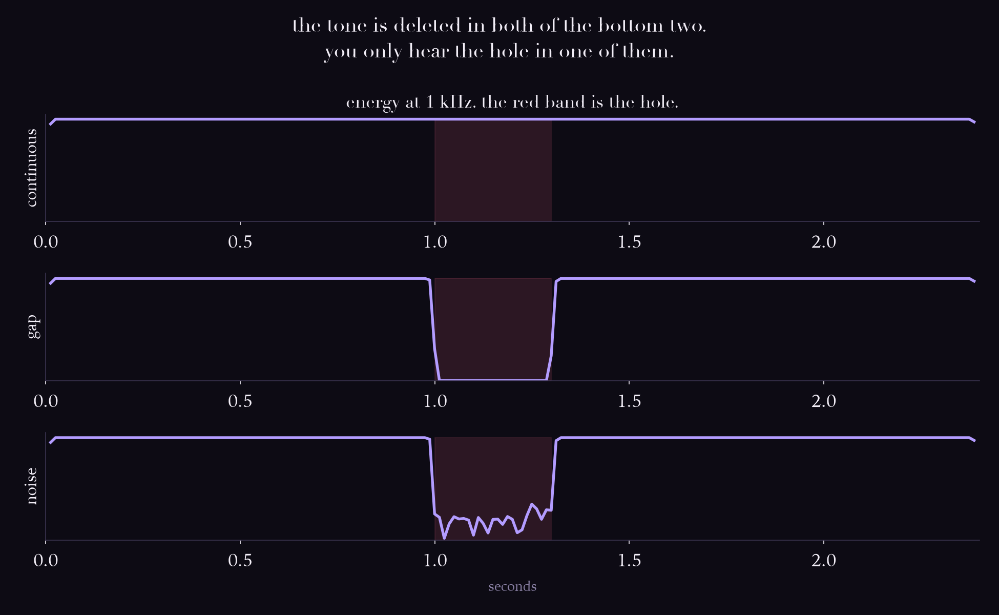
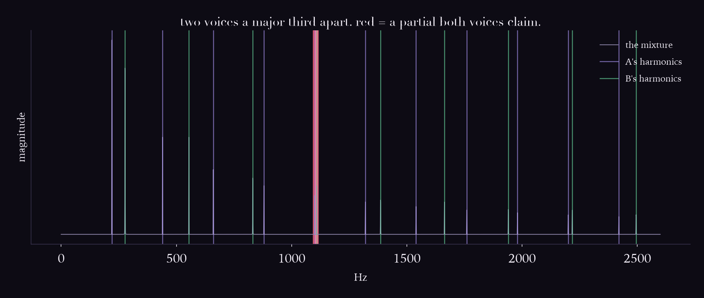

# Day 08: The cocktail party problem

The keystone day. This is the field's founding problem, and the clean joint where music
cognition and machine listening are the same subject.

## The ear does this

Bregman's **auditory scene analysis** (1990). One pressure wave arrives at your eardrum,
carrying every source in the room summed together, and you unpick it into separate
streams: this voice, that voice, the fridge. You do it without effort or training, and it
is arguably the hardest thing your auditory system does.

The cues are grouping heuristics: common onset, harmonicity, common fate, continuity,
spatial location.

## The machine does this

Computational auditory scene analysis (CASA). Code the cues up directly, in the tradition
of Wang and Brown.

## Where it breaks

### 1. Your ear invents sound that was deleted



The **continuity illusion**. Take a 1 kHz tone, cut a 300 ms hole in it, and drop loud
broadband noise into the hole:

| file | energy at 1 kHz inside the hole | the tone is |
|---|---|---|
| `tone_continuous.wav` | 100.1% | present |
| `tone_gap.wav` | 0.0% | **deleted** |
| `tone_noise.wav` | 17.8% | **deleted** |

The tone is equally absent in both of the bottom two — deleted from the same samples. But
broadband noise has energy everywhere, so during the burst there *is* 17.8% of the
reference level sitting at 1 kHz. It just isn't the tone.

A meter cannot tell those apart. Energy at 1 kHz is energy at 1 kHz.

Your auditory system resolves that ambiguity in one specific direction: the noise is loud
enough that it *would* have masked the tone, so the evidence is consistent with the tone
continuing underneath, so it hands you a tone. Bregman's "old-plus-new" heuristic.

**Listen to `tone_gap.wav` then `tone_noise.wav`.** Same hole. You will only hear one of
them. The tone you hear during the noise was never recorded.

### 2. Harmonicity works perfectly, and is still useless



Two harmonic voices a major third apart, and the harmonicity cue handed **both true f0s
for free**:

| | |
|---|---|
| energy assigned to A that really came from A | **100.0%** |
| energy assigned to B that really came from B | **100.0%** |
| ambiguous | 3.3% |

I expected this to fail and it did not. So the question became where it *does* fail.

| interval | bins only B owns | shared | separable? |
|---|---|---|---|
| major third | 77 | 8 | yes |
| perfect fifth | 18 | 18 | yes |
| **octave** | **0** | 36 | **impossible** |

At the octave, voice B owns **zero** bins of its own. Every harmonic of 440 is also a
harmonic of 220. Harmonicity is not *bad* at octaves, it is structurally incapable of
them, and no tuning fixes that.

**And notice the direction.** Third → fifth → octave is the order of increasing
**consonance**, because consonance *is* harmonic overlap. Music is built out of precisely
the cases that defeat this cue. The nicer two notes sound together, the less separable
they are.

### 3. The loop with no entry point

Every number above assumed both f0s were already known. Ask for them instead:

| | |
|---|---|
| YIN on the mixture | **274.6 Hz** |
| notes actually present | 220.0 and 277.2 Hz |

Neither. Day 6 showed why: YIN models one periodic source and returns one number.

So **to use harmonicity you need the f0s, and to get the f0s you need the voices
separated.** There is no entry point. Every cue in this lab is real, correctly
implemented, and the system still cannot start.

That is why rule-based CASA stalled, and why the field stopped writing the rules and
started learning the separation instead. That is day 9.

## Run it

```bash
source .venv/bin/activate
cd labs/day-08-asa
python continuity.py
python grouping.py
```

Listen: `tone_gap.wav`, then `tone_noise.wav`.

## Sources

- Bregman, *Auditory Scene Analysis: The Perceptual Organization of Sound*, MIT Press, 1990
- Wang and Brown, *Computational Auditory Scene Analysis*, Wiley/IEEE, 2006
- Warren, "Perceptual restoration of missing speech sounds," Science, 1970 (the continuity illusion)
- Darwin, "Perceptual grouping of speech components differing in fundamental frequency," 1981
- Cherry, "Some experiments on the recognition of speech, with one and with two ears," JASA, 1953 (the original cocktail party paper)
